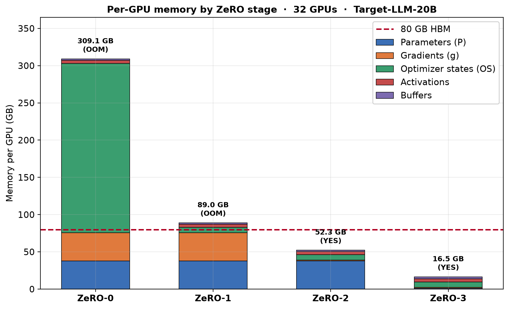
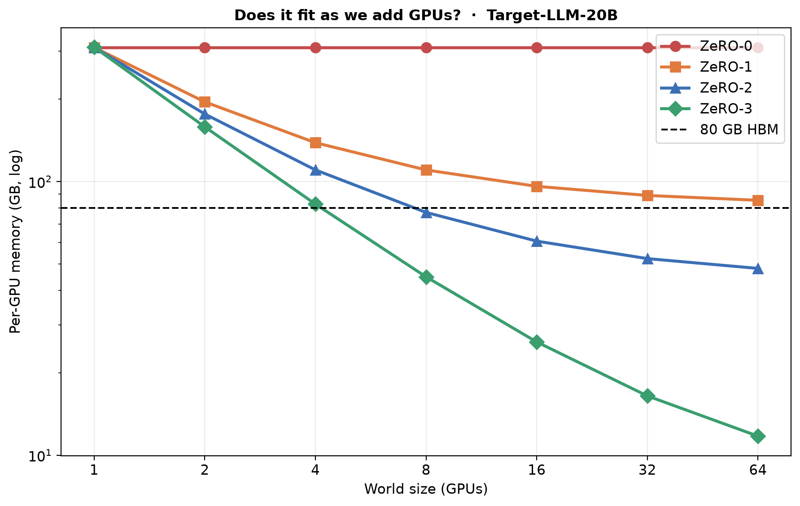
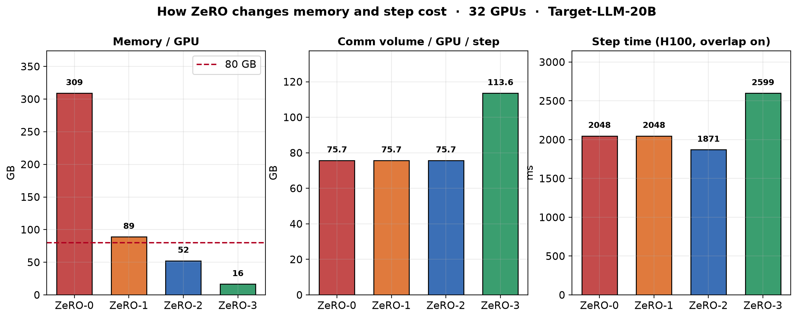
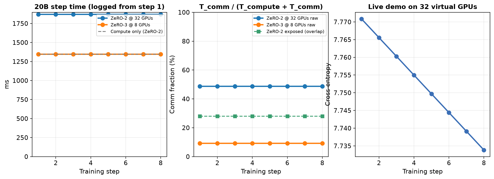
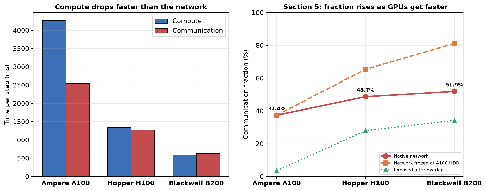
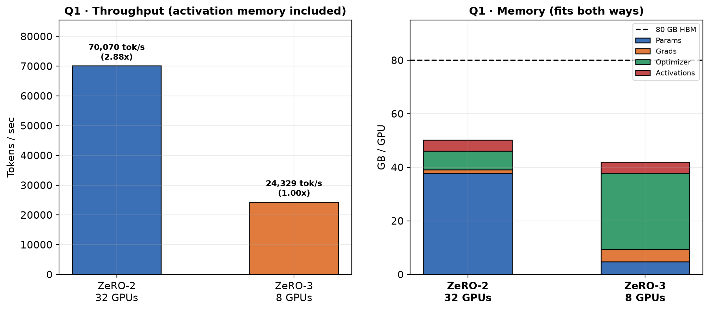
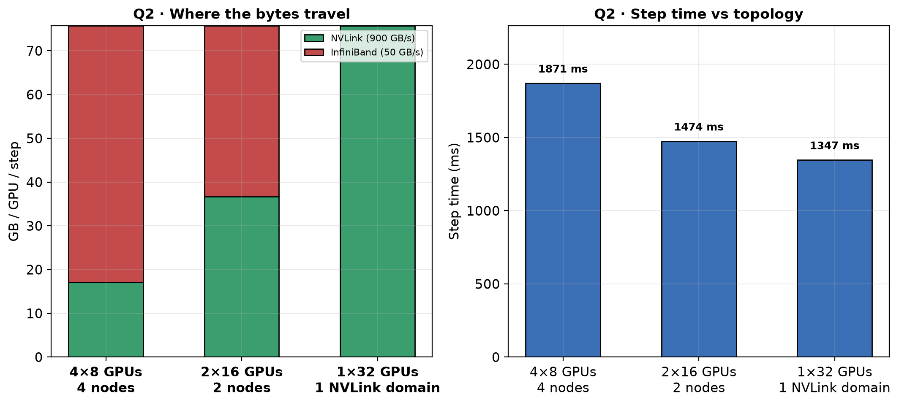
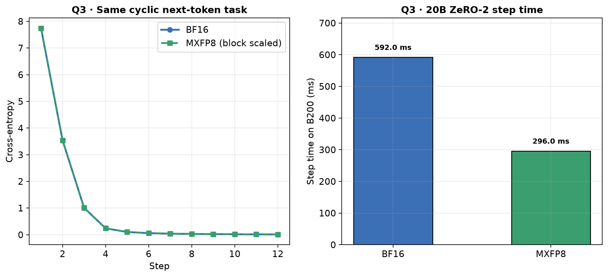
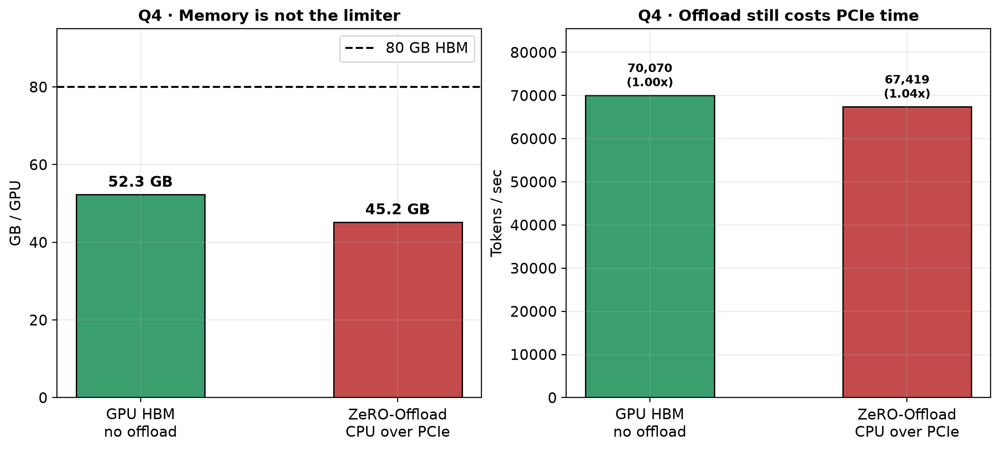

# Assignment: ZeRO-1 / ZeRO-2 / ZeRO-3 on 32 Virtual GPUs

**Submit this notebook:** [`ZeRO_Parallelism_Simulation.ipynb`](./ZeRO_Parallelism_Simulation.ipynb)

The ask is: 32 virtual GPUs (CPU threads), a demo model on top, simulate ZeRO-1 / ZeRO-2 / ZeRO-3, show how memory and computation change.

| Ask | Status |
| --- | --- |
| 32 virtual GPUs | 32 `VirtualGPU` ranks, 8 per node, each rank runs a real GEMM on a CPU thread |
| Demo model | Small Transformer trained on that cluster |
| ZeRO-1, ZeRO-2, ZeRO-3 | All three engines take real train steps |
| Memory + computation | Stacked memory bars; FLOPs stay constant, comm volume is \(2Ψ\) then \(3Ψ\), step time follows |

Open the notebook and run top to bottom. Details of the 20B / four-question analysis stay in `zero_simulation/` and `plots/` if you want them.


---

## What I understood about ZeRO

Standard data parallelism copies the full training state onto every GPU:

| Piece | Mixed-precision bytes | On every GPU? |
| --- | --- | --- |
| Parameters \(P\) | \(2\Psi\) | yes (ZeRO-0, 1, 2) |
| Gradients \(g\) | \(2\Psi\) | yes until ZeRO-2 |
| Adam states \(OS\) (fp32 master + \(m\) + \(v\)) | \(12\Psi\) | yes until ZeRO-1 |

That is \(16\Psi\) per GPU. ZeRO does not change the math of SGD. It **partitions redundant copies** across the data-parallel group \(N_d\):

- **ZeRO-1 \(P_{os}\)** — shard optimizer only. Floor as \(N_d \to \infty\) is still \(4\Psi\) (full \(P\) + full \(g\)).
- **ZeRO-2 \(P_{os+g}\)** — also shard gradients. Floor is \(2\Psi\) (full parameters remain).
- **ZeRO-3 \(P_{os+g+p}\)** — also shard parameters. Floor is \(16\Psi / N_d\). Forward/backward AllGather a layer, then ReduceScatter its grads. Volume is **\(3\Psi\)** per step, vs **\(2\Psi\)** for ZeRO-0/1/2.

Our **20.33B** target (\(h=6144\), \(L=44\), vocab \(32\)k) in bf16:

- \(P = g = 37.86\) GB
- ZeRO-0 ≈ **309 GB / GPU** → OOM
- ZeRO-1 on 32 GPUs ≈ **89 GB** → still OOM. Even \(N_d \to \infty\) leaves \(P+g\) plus activations and NCCL workspace **above 80 GB HBM**
- So the run **cannot start** on data parallel or ZeRO-1. The real choice is **ZeRO-2 from 32 GPUs** or **ZeRO-3 from 8 GPUs**

I log **communication as a fraction of step time from step 1**:

\[
\text{comm fraction} = \frac{T_{comm}}{T_{compute}+T_{comm}}
\]

Gradient **bucketing** and **overlap** are on from the start. They hide latency; they do **not** shrink volume. Section 5 of the ZeRO paper is the reason: as Tensor Cores get faster, that fraction **goes up** unless the network keeps up.

---

## How memory and computation change



On 32 GPUs, only ZeRO-2 (**52.3 GB**) and ZeRO-3 (**16.5 GB**) fit in 80 GB HBM. ZeRO-0 and ZeRO-1 do not.



ZeRO-1’s curve flattens above the 80 GB line. Adding GPUs never saves you if parameters and gradients stay replicated.

Compute FLOPs per token are the same (each rank still runs a full forward/backward). What changes is **bytes on the wire** and **exposed step time**:



ZeRO-2 is the cheap communication point (\(2\Psi\), overlap hides ReduceScatter). ZeRO-3 buys more memory headroom with **\(1.5\times\)** more traffic and a slower step on the same 32-GPU mesh.

---

## 32 virtual GPUs + live demo

Each rank is a `VirtualGPU` with its own memory counters, node id (8 GPUs / node), and ring collectives (`AllReduce`, `ReduceScatter`, `AllGather`). A small Transformer actually steps on that cluster. The 20.33B numbers are analytic (FLOPs / peak TFLOPS × 50% MFU, plus ring time on NVLink vs InfiniBand) so the assignment’s **20B memory wall** is visible on a laptop.



Left/middle: 20B ZeRO-2 @ 32 and ZeRO-3 @ 8, **from step 1**. Overlap cuts the *exposed* fraction; the *raw* fraction is what Section 5 cares about. Right: live 32-rank demo loss.



A100 → H100 → B200: compute time collapses. Native comm fraction still rises **37% → 49% → 52%**. If InfiniBand stayed at A100 HDR, it would rise toward **~80%**. Bucketing/overlap is why the green “exposed” line stays lower without moving fewer bytes.

---

## The four questions

### 1. ZeRO-2 on 32 GPUs, or ZeRO-3 on 8?

*Settled by step time on this architecture, with activation memory included.*



| | ZeRO-2 · 32 GPUs (4×8) | ZeRO-3 · 8 GPUs (1 node) |
| --- | --- | --- |
| Memory / GPU | **52.3 GB** (fits) | **44.9 GB** (fits) |
| Comm volume | \(2\Psi\) | \(3\Psi\) |
| Throughput | **70,070 tok/s** | 24,329 tok/s |
| | **2.88× faster** | baseline |

Both fit. I pick **ZeRO-2 on 32 GPUs** because the extra 24 GPUs and the cheaper collective win, not because ZeRO-3 is illegal.

### 2. How many GPUs per node, and how many nodes?

*Settled by the ~18× gap between NVLink (900 GB/s) and InfiniBand (50 GB/s): keep traffic inside a node.*



On **4 nodes × 8 GPUs**, **77.4%** of the ring is InfiniBand. Putting all 32 GPUs in one NVLink domain cuts **communication time 93%** (1279 ms → 90 ms). Step time drops less (compute is still ~1.3 s) but the slow hop disappears. Practical layout: **8 GPUs/node, 4 nodes**, one NIC per GPU, overlap left on. Prefer a 32-GPU NVLink rack if you can buy it.

### 3. Is 8-bit arithmetic committed from the start?

*Settled by a short BF16 vs MXFP8 run (loss) plus 20B step time on Blackwell.*



Same cyclic next-token task: both losses fall together to **0.013**. On B200, MXFP8 is **2.00×** faster (296 ms vs 592 ms) and halves the ZeRO payload (75.7 GB → 37.9 GB). That **does** commit the cluster to **Blackwell**. On Hopper I would stay on bf16/FP8-E4M3, not pretend MXFP8 exists.

### 4. Does any state go to system memory?

*Settled by whether the chosen stage is memory-bound or communication-bound.*



ZeRO-2 @ 32 uses **52.3 / 80 GB** (**35% free**). The run is **communication-bound** (raw fraction **48.7%**, **28%** still exposed after overlap), not memory-bound. Offloading the Adam shard over PCIe Gen5 adds **74 ms** and is **1.04× slower** for capacity we already have. **No state goes to CPU DRAM.**

---

## Layout

```
zero_simulation/          # virtual GPUs, collectives, ZeRO engines, four questions
scripts/run_simulation.py # regenerates plots/
tests/test_simulation.py
ZeRO_Parallelism_Simulation.ipynb
plots/                    # screenshots used in this README
```

```bash
python -m venv .venv && source .venv/bin/activate
pip install -r requirements.txt
python -m pytest tests/test_simulation.py -v
python scripts/run_simulation.py
jupyter notebook ZeRO_Parallelism_Simulation.ipynb
```

The demo path uses CPU (or Colab GPU if you have one). 32 ranks are virtual: one real `nn.Module` plus 32 memory/comm accounts, which is what “32 virtual GPUs” means on a single box.
